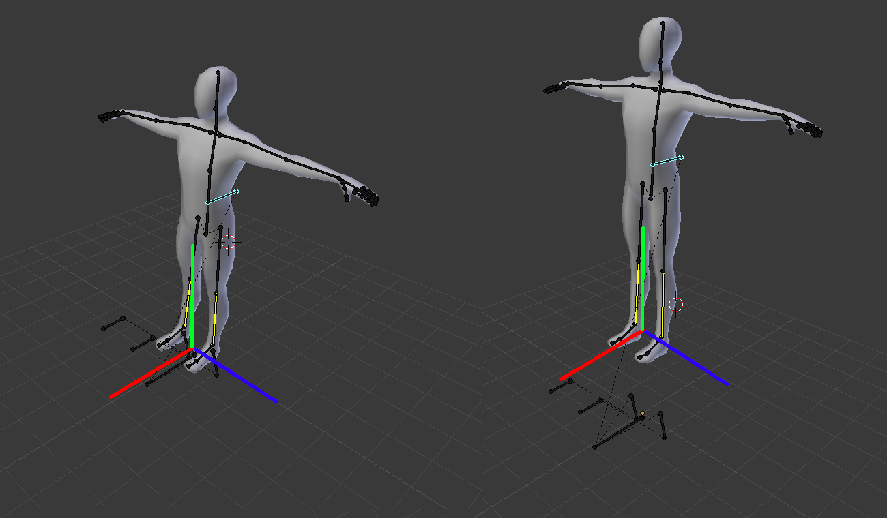
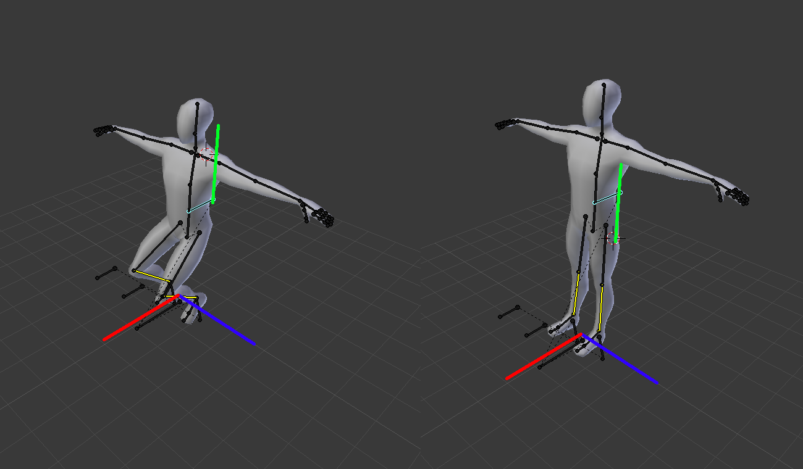

> Status: ** early draft **, last update 10-Apr-2015

### NavigationPosition:
Currently the Cyberith Virtualizer has no plans to support a device side calculation for absolute positions. An analysis plugin would be needed for our device to provide this kind of data. 

## Answered questions
- **Q**: What is the Cyberith haptic feedback?
- **A**: The haptic feedback API is a simple vibration feedback for the surface under the player/person. This would fall into the output device section and is not really part of locomotion itself.

- **Q**: Is it correct to limit this class to the 2D ground plane?
- **A**: In my opinion, moving affects tracking points on every axis. X and Z for moving on a 2D ground plane, and jumping affects the Y axis of every Tracker point. 

- **Q**: Should locomotion device be merged into a tracker?
- **A**: I see the point in merging locomotion devices into simple trackers with additional configuration but I also think that it may be not a good idea.

- **Q**: Should we use polling or events?
- **A**: In general everything is designed to get called in polling mode because all the values are absolute and can be applied directly. In my opinion, callbacks add another layer of buffering and should be avoided in time critical cases, like input (at least if it is not a button). For example, without further research or investigation I have seen that the analog value callbacks of OSVR in one of the Unity demos are getting called multiply times in one frame.

## Open questions
The document mentions "body orientation, jump/crouch sensing are best factored into other device classes". Orientation is definitely something tracker related. It is a value which is obsolete if you are using a body tracking suit.

Jumping/crouching, or better the players height in general, on the other hand is better suited in the locomotion class in my opinion. 

From what I understand, tracker points are points with absolute values which do not have a defined relation to each other? Is there a skeleton example somewhere (For PrioVR for example)? So how does a locomotion device affects these points?
- If it manipulates X and Z of every child point of the body parent, then the player height has to affect these points as well. So movement would be 3D instead of 2D applied on the parent object. 

- If its possible to have something like a pivot point of a body (maybe the hips), then the player height is more like a Tracker which moves this pivot point and the body/tracker moves with it. And the body as a whole on the other hand will be moved by a 2D vector. But this implies that the Tracker points are connected by joints and joints are supported.

So what is the plan about relations between Trackers or how is it planned to enable the possibility to manipulate a subset of Trackers in some way? 

