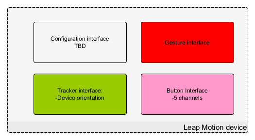

# OSVR Device Integration and Factoring Proposal: Nod Ring

> Prepared by Sensics, Inc. Last modification 10-Apr-2015

> Status: in discussions

This document lays out a proposed strategy for making a Nod Ring device functionality available in OSVR, including how to factor it into the generic device interface classes.

## Overview

## Configuration/Instantiation
We recommend that your plugin auto-configure instances of your device, one for each Nod Ring connected to the computer. Since each unit has a unique identifier, we recommend using this ID as a part of the device name, as in `Ring12345`, which would result in a full device path (including the plugin name) of something similar to `/com_nod_nodring/Ring12345`. Alternately, if your configuration tool assigns unique user-facing names to each device, that could be used in place of the unique numeric ID.

The goal with the naming scheme is to facilitate persistent semantic association of tracking data with the device reporting it, which is currently done through the OSVR server config file. The use case considered that drove this suggestion was the use of multiple rings to track multiple fingers, and the question of associating data with its correct finger.

## Interface Classes
The following interface classes are recommended for a first pass at the plugin, and are already available to code against in OSVR:

- Tracker interface: A device instance would have one channel reporting device orientation. Note that the overall coordinate system of OSVR is right-handed, with X to the right and Y up. Be sure to use either existing integration code or the specific "setter" functions to ensure that the quaternion data is populated in the order (WXYZ vs XYZW) used in OSVR. Additionally, you will want to document (in the human-readable documentation accompanying your plugin) the ring's coordinate system and neutral orientation.
- Button interface: A device instance would have five channels, reporting the hardware buttons on the ring.

At a later date, the following interface classes will become available for enhanced functionality:

- Gesture interface: for exposing gestures recognized by your SDK (up, down, left, right, and rotations)
- Device status interface: for reporting battery levels.

## Device Descriptor
OSVR devices provide a JSON device descriptor to the core that describes their capabilities, identifies the interfaces and channels provided in a human-friendly and semantic way, and more.

Your device should provide a static JSON descriptor, identical for each device interface and submitted once during the creation of each instance. It will indicate at least the orientation-only nature of the tracker reports, as well as identify the buttons more clearly than a numeric ID.

The OSVR distribution includes a few samples of JSON device descriptors as well as a JSON-Schema for the existing interfaces. A preview version of a web app based on the schema is available to help compose them. OSVR-Core includes a tool that reads in a JSON file, parses and compacts it, and writes out a header file with the resulting contents as a string literal, so you can easily and automatically embed a JSON descriptor maintained as a separate file into your compiled plugin. The example plugin build system includes an example of this functionality.

If your configuration tool makes associations between rings and parts of the body, you may consider at a later date discussing with us how your device instances may be able to suggest default system-wide semantic paths for their data.

Let us know if you think there is important metadata about your device that is not accounted for in the current JSON schema. For extensibility, the core does not validate submitted JSON against the schema, so it is a starting point, not a limit, but your observations can help improve the system for all.

## Async Device Style
As a general guideline, we'd recommend creating an `Async` device plugin, which allows your code to block until you receive new data, which you then report. In an `Async` plugin, the OSVR core handles the thread creation and synchronization, safely permitting access to shared OSVR resources automatically.

If your update rate is very high and your SDK provides a means for rapidly checking for updates and returning, a `Sync` plugin (whose callback runs in the server's tight main loop) may be appropriate, but we'd suggest at least starting with an `Async` plugin, and changing to a `Sync` device only at a later date and only if needed. (This involves only one line of code change.)

## Platform Support
OSVR is designed from the ground-up to be cross-platform, from multiple desktop platforms to mobile. The PluginKit API you'll use in your plugin is identical across all platforms, both those currently supported and those we anticipate the community supporting. As such, we encourage you to make your plugin as cross-platform as possible. Using the recommended CMake build system as provided for by the example is a good step.

Presently, our largest user community is on Windows, so a functional plugin there is likely of first priority. However, we recommend taking steps (such as use of CMake) that will make it easy to later add support on other platforms.

If your SDK varies substantially between platforms, you may need to use different code on each platform. We'd encourage you to keep as much code, including the plugin name and JSON descriptors, common between all platforms.

## Open Questions
- **Q**: Need to define names for each of the 5 buttons

## Collaboration
As your device uses existing interface classes, we are confident that your development experience should be smooth. However, to aid us in our ability to support you, if your plugin is developed in a private GitHub repository, we suggest adding a team with read access to that repository, with the following Sensics staff added to that team:

- Ryan Pavlik - GitHub username `rpavlik`
- Yuval Boger - GitHub username `yboger`