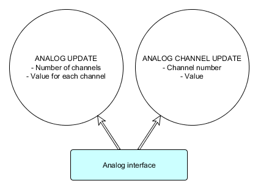

# Interface Class Specification: Analog

## Device class summary

> Status: **implemented**

This is a basic device class for exposing one or more "channels"/sensors of floating-point-valued (double precision) data. No explicit meaning is necessarily ascribed to a given channel or group of channels. The number of channels is bounded and typically known at startup.

Like Tracker and Button, this is one of the "classic" VR device classes, carried over from VRPN. The canonical example of analog input would be a slider, analog trigger button, or an axis of a joystick. Those examples all have a known, and fixed, minimum and maximum value, and all but the slider also have restorative force that bring them to a "default" value (center in the joystick, minimum in the trigger). These values are not necessarily standard across peripherals, but they can be described in the JSON device descriptor so that, for instance, joystick axis data can be mapped to the range [-1.0, 1.0].

Beyond input devices that are clearly analog, the Analog interface is also useful as a catch-all for providing access to scalar or vector data that doesn't fit other interface classes. These associations are particularly important to describe in the JSON device descriptor. If common sets of data arise in multiple devices, it is worthwhile to consider a new interface class or a new message in an existing interface class to provide a standard way of providing the given data. Additionally, before using analog channels to report data, be sure that there isn't already a standard interface class message that is more closely suited to the data.

Units are not standardized, due to the wide array of uses

### Examples
- Conventional uses:
	- Joystick axes.
	- Analog trigger on Razer Hydra and other game controller.
	- Fader/slider.
	- "3D mouse" like a SpaceMouse.
- Use as a general data transport:
	- Compass vector and confidence value from YEI 3Space tracker.
	- Point tracking, gravity, and "Balance Board" force sensor data from Nintendo Wii peripherals.
	- Bend sensor values for 5DT gloves
	

### Relation to other classes
**Factoring**: Before reporting something unconventional (not clearly an analog input device) as analog channels, make sure that it doesn't fit more specifically into an existing interface class and message.

**From other instances of the same interface**: Analysis plugins or routing might re-map analogs to a specific known range of values, particularly in the case of conventional analog input. Filtering could be applied to bend sensor data.

**To other classes**: VRPN provides an AnalogFly device that uses analogs, such as from a joystick or a SpaceMouse-style device, to simulate a tracker. Specific sources of analog input could be processed by an analysis plugin to produce tracking data, etc. Bend sensor data could be thresholded to become button data, or interpreted along with a kinematic model to produce tracker/skeleton data.

## Overview
The Analog interface is summarized in the following diagram:

## Messages
In the transport, the value of all channels/sensors is reported with each message. Thus, whether a device sends a single channel update or a full new set of channel values, the full data is sent in each message. Receipt of a callback on a specific channel does not necessarily mean that channel was modified (in fact, no filtering is done, so the same data could be sent repeatedly -- by design, since the measured data may not have changed), just that the device reported updated state.

### Analog Update
#### Data
- Number of channels
- Value for each channel

#### Rationale
This is the core underlying message, containing all values from a given device's analog interface. It may be produced all at once, by an update step of the device or analysis. It is not often consumed in this way by client applications, however.

### Analog Channel Update
#### Data
- Channel number
- Value

#### Rationale
This message is generated automatically from a full Analog Update, allowing callbacks and interface objects used just for state to receive data on only a single channel.

A device updating just a single channel will trigger a full Analog Update with the stored state changed for the single channel specified. Thus, if a device has data for more than a single channel, it should update all of them (resulting in a single message/overall state change), rather than make multiple calls to update individual channels (artificially producing intermediate messages and states with each update).
