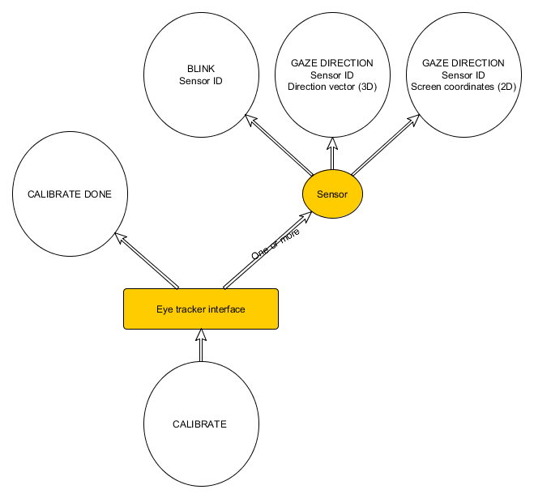

# Interface Class Description: Eye Tracker

> status: Completed

## Device class summary
The eye tracker devices provide detailed information about one or both eyes movement. It includes tracking gaze direction using 2D or 3D coordinates, detecting blink events and others (eye fixation, saccades, etc.). Tracker can support binocular and monocular modes. For binocular mode, it will report data based on sensors for both eyes. In monocular mode, only one sensor will provide data. 
The tracker plugin can choose to implement both types at the same time, so that a binocular tracker would also have two monocular trackers.

### Examples
- SMI Eye Tracking product: <http://www.smivision.com/en/gaze-and-eye-tracking-systems/home.html>
- Arrington Research : <http://www.arringtonresearch.com/>
	

### Relation to other classes
**Factoring**: An eye tracker may contain additional features (for example, streaming eye images) that are best factored into other devices classes, such as Imaging. The eye tracker device interface class is only concerned with reporting gaze and blink data. This means that physiognomy data (such as pupil size, pupil aspect ratio, IPD, IOD, eye relief) should be reported in other interface classes: in particular, as analog channels, with meters as the distance units. The JSON device descriptor provides the ability to describe the semantic meaning of these channels.

An eye tracker that provides 3D eye tracking may also want to report a tracker sensor for each eye. While the data described below as a point and a direction does not fully constrain a 6DOF rigid pose, it can be converted into one by choosing -Z as gaze-forward and assuming Y is up (that the eyes are not rotating in their sockets). This is not an opthamologically-valid assumption but it is valid for many other uses of eye tracking.

**Eye tracking from other classes**: Eye tracking algorithms could be created as analysis plugins taking in input from an imaging interface.

## Overview
The Eye tracker interface is summarized in the following diagram:

## Messages
An eye tracker may report 2D Gaze Position, 3D Gaze Base Point and/or 3D Direction, and Eye Blinks - this should be described in the device descriptor data. Reporting at least one of those messages is required.

### Gaze Position (2D)
#### Data
- Sensor ID
- A 2D vector containing the user's gaze/point of regard, in normalized display coordinates (each component in the range [0, 1], with the display effectively forming that portion of the X-Y plane in the standard OSVR coordinate system).

#### Rationale
An application may wish to draw directly on the point of the screen that the user is looking at. This is one class of applications for eye tracking data, and applications using it are unlikely to also want 3D data, or at least handled in the same method.

### Gaze Direction (3D)
#### Data
- Sensor ID
- A 3D vector (position) containing gaze base point of the user's respective eye in 3D device coordinates.
- A 3D vector (direction vector) containing the normalized gaze direction of the user's respective eye.

#### Rationale
Describes the user's gaze as a ray. This data can be reported in a tracker sensor in addition to this eye-tracker-specific message.

### Blink
#### Data
- Sensor ID
- Blink state represented by button state (either 0 or 1)

#### Rationale
This is an event that can be reported, but is not required.

## Open issues

- There are additional data that can be retrieved from the tracker, that may be useful in applications which include:
	- Duration + location of fixation
	- Loading/saving user profile, if necessary
- When the tracker "loses" pupils (For example, user takes off the HMD), should a special event be generated to let application know of situation?
- Do all eye trackers that report a 3D gaze direction also provide a point as well?
- Calibration, not required, would need Calibration method for client to send to plugin to perform remote procedure call to trigger vendor-specific calibration; Calibrate "done" is a notification from plugin to client that RPC calibration has been completed.

## Other resources
- <http://en.wikipedia.org/wiki/Eye_tracking>
