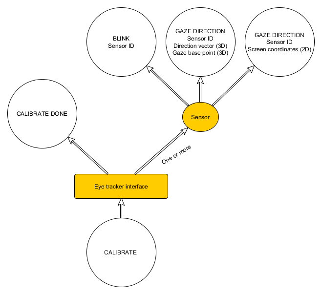

# Interface Class Description: Eye Tracker

> status: in discussions

## Device class summary
The eye tracker devices provide detailed information about one or both eyes movement. It includes tracking gaze direction using 2D or 3D coordinates, detecting blink events and others (eye fixation, saccades, etc.). Tracker can support binocular and monocular modes. For binocular mode, it will report data based on sensors for both eyes. In monocular mode, only one sensor will provide data. 
The tracker plugin can choose to implement both types at the same time, so that a binocular tracker would also have two monocular trackers.

### Examples
- SMI Eye Tracking product: <http://www.smivision.com/en/gaze-and-eye-tracking-systems/home.html>
- Arrington Research : <http://www.arringtonresearch.com/>
	

### Relation to other classes
**Factoring**: An eye tracker may contain additional features (For example, streaming eye images) that are best factored into other devices classes, such as Imaging. The eye tracker device class is only concerned with reporting gaze direction, detecting blink events, and few additional features(TBD) .
**Eye tracking from other classes**: Eye tracking algorithms could be created as analysis plugins taking in input from an imaging interface.

## Overview
The Eye tracker interface is summarized in the following diagram:

## Messages
An eye tracker may report Gaze Position, Gaze Direction, or both - this should be described in the device descriptor data. Reporting at least one of those messages is required.

### Gaze Position (2D)
#### Data
- Sensor ID
- A 2D vector containing the user's gaze/point of regard, in normalized display coordinates (each component in the range [0, 1], with the display effectively forming that portion of the X-Y plane in the standard OSVR coordinate system).

#### Rationale
An application may wish to draw directly on the point of the screen that the user is looking at. This is one class of applications for eye tracking data, and applications using it are unlikely to also want 3D data, or at least handled in the same method.

### Gaze Direction (3D)
#### Data
- Sensor ID
- A 3D vector (position) containing gaze base point of the user's respective eye in 3D device coordinates.
- A 3D vector (direction vector) containing the normalized gaze direction of the user's respective eye.

#### Rationale
Describes the user's gaze as a ray. This data can be reported in a tracker sensor in addition to this eye-tracker-specific message.

### Blink
#### Data
- Boolean event that will signal whether the blink had occurred 

#### Rationale
Certain trackers provide support for detecting blink events, therefore this feature is optional. 

### Calibration
#### Rationale
Allows the plugin to start calibration process and detect when calibration is done. Calibration can initially be vendor-specific.

An application would likely compute a "delta-position" at its convenience, rather than explicitly using the position directly. Devices could report this themselves (particularly in active devices where this can be directly measured), or an analysis plugin could perform the integration to add these messages to 

### Physiognomy 
#### Data
##### IPD
- float containing the distance betweeen the pupil centers in mm

##### IOD
- float containing the distance betweeen the eye-ball centers

##### Eye relief
- float containing the distance betweeen the pupil center and the HMD's lens

##### Pupil size
- float containing the diameter of the pupil in mm
	

#### Rationale
In order to allow for personalized rendering/ display calibration additional information about the users physiognomy are required.

## Open issues

- There are additional data that can be retrieved from the tracker, that may be useful in applications which include:
	- Pupil Aspect Ratio
	- Duration + location of fixation
	- Loading/saving user profile, if necessary
- When the tracker "loses" pupils (For example, user takes off the HMD), should a special event be generated to let application know of situation?

## Other resources
- <http://en.wikipedia.org/wiki/Eye_tracking>
