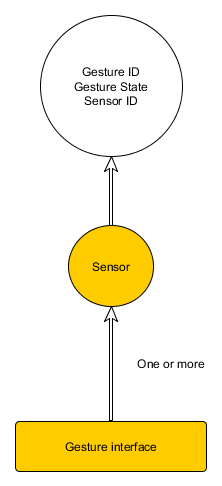

> Status: early draft, last updated 10-Apr-2015

This is a work area for gesture interface class specifications.

A gesture interface communicates high-level gestures such as "fist closed", "thumb up", "pinch", "zoom", "swipe" and so forth.

Several type of devices can detect gestures. These include:

- Hand and finger trackers such as Softkinetic
- Thalmic myo
- Nod ring

Gestures could be hand or finger gestures, but could also be head gestures such as "yes" or "no". Two-handed gestures are also possible.

At face value, this is a simple interface as it generates just a gesture event.

The question becomes, how are these gestures defined. are they:

- Enumerated gestures with a placeholder for user-defined or vendor-defined gestures
- Strings containing the names of gestures (or integer-mapped strings like VRPN uses to make it rapid to transmit and parse while providing generality of naming).
- A signals/slots mechanism like Qt.
- All gesture objects have pure virtual methods that know how to read themselves from and write themselves to a file interface, so that they can pack and unpack anything.  One step back from full generality would have them read themselves from and write themselves to Json and then transport the Json as the parameters.

## Overview

