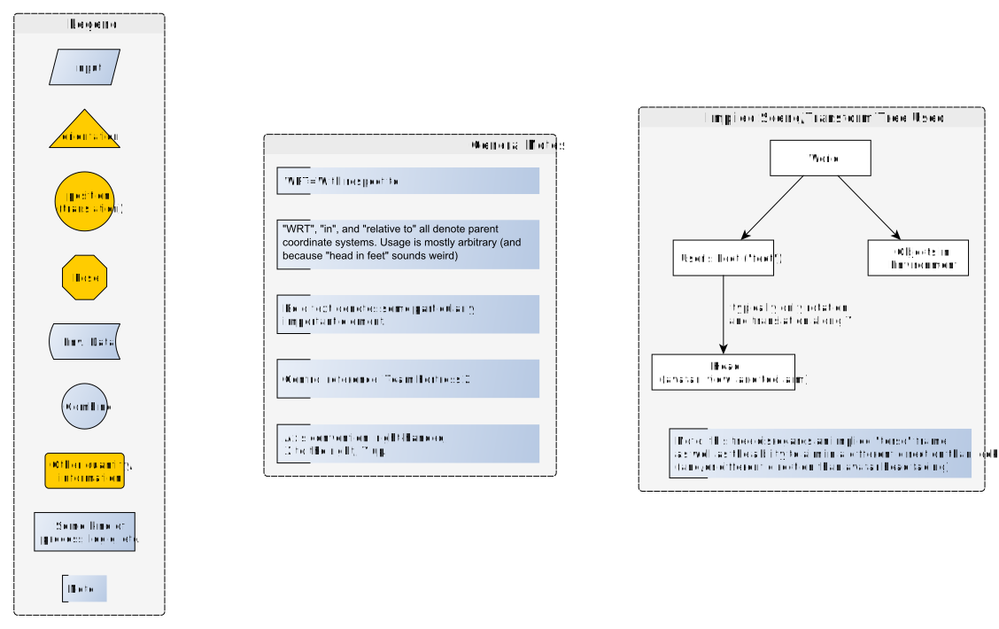
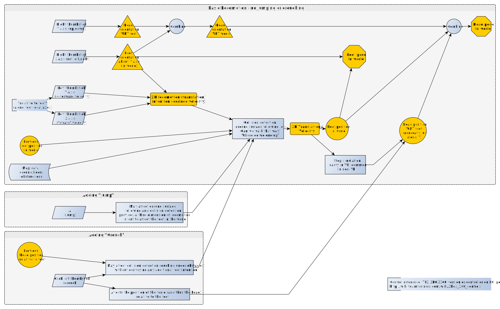

# Existing FPS Control Schemes

Original author's note:
> In an attempt to elucidate whether ODTs present a specific case of "tracker" data or merit separate handling *in the core* (not whether they should get their own plugin-side API for ease of integration), I've prepared these diagrams showing my understanding of the processes involved in navigation/locomotion in non-VR first-person-shooter titles and games with similar first-person interaction.
>
> The diagrams are made in yEd (the `.graphml` files are the original source) which can be used at no cost, and have been exported to SVG for viewing in a web browser. (Hooray, web browsers can be trusted with SVG finally!)
>
> -- Ryan Pavlik, 26-June-2015

## FPS Controls Common

- [SVG](FPS Controls Common.svg)
- [graphml/yEd](FPS Controls Common.graphml)

## FPS controls - Desktop WASD with mouselook

- [SVG](FPS controls - Desktop WASD with mouselook.svg)
- [graphml/yEd](FPS controls - Desktop WASD with mouselook.graphml)

## FPS controls - Gamepad - XBOX360

- [SVG](FPS controls - Gamepad - XBOX360.svg)
- [graphml/yEd](FPS controls - Gamepad - XBOX360.graphml)

