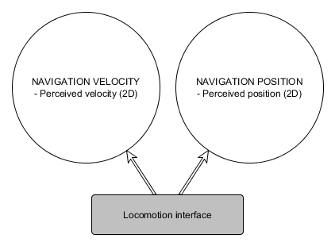
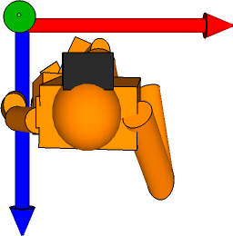
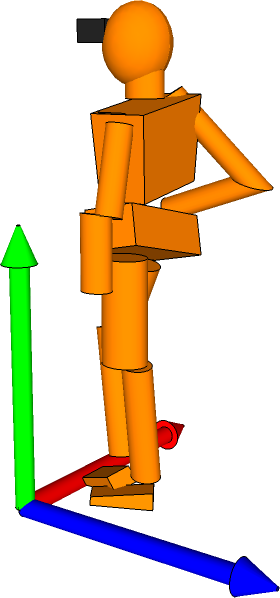

# Interface Class Specification: Locomotion Devices

> Status: Completed

## Device class summary
This class of devices encompasses a range of systems, many referred to as "omni-directional treadmills" (ODT), designed to provide a walking-type navigation input into a virtual environment, on a *2D ground plane*.

### Examples
- Cyberith Virtualizer: <http://cyberith.com/product/>
- Virtuix Omni: <http://www.virtuix.com/products/>
- Other related devices:
	- WizDish: <http://www.wizdish.com/>
	- Infinadeck (active ODT): <http://www.infinadeck.com/>
	- Virtusphere (human hamster ball): <http://www.virtusphere.com/>

### Relation to other classes
**Factoring**: A number of ODTs feature additional features (body orientation, jump/crouch sensing, etc) that are best factored into other device classes, specifically Tracker. The locomotion device class is concerned solely with reporting of whole-body movement intention on the ground.

**Locomotion from other classes**: It is trivial to conceptualize an analysis driver converting some other input (for example, analog joysticks) into locomotion, for development or other purposes. Such a transformation may be more sophisticated a research field (consider the ["Silver Surfer" interface using the Wii Balance Board by Wang and Lindeman](http://dx.doi.org/10.1109/3DUI.2011.5759235)) Potentially, a redirected walking implementation might expose the "virtual locomotion" as a locomotion interface, together with an orientation to be used as as an offset.

**Locomotion to other classes**: The design of some virtual environments means that having a "tracked" virtual position of the user in the world may be useful. As such, similar to the `vrpn_AnalogFly` device, an analysis driver could generate a simulated tracker report based on a locomotion interface.

## Overview
The Locomotion interface is summarized in the following diagram:

## Messages
In general, to work smoothly with the rest of the OSVR system, distance units are meters and velocity units are meters/second.

### NavigationVelocity
#### Data
- A 2D vector containing the current user's perceived/simulated velocity, in the world coordinate system, in meters/second.

#### Rationale
This is the general base format of output from such devices. It is the most common report, likely reported by all devices in this class.

### NavigationPosition
#### Data
- A 2D vector containing the user's current perceived/simulated position, in the world coordinate system, in meters, relative to an arbitrary starting position.

#### Rationale
This is an optional message, only sent if the device itself measures it, or if an analysis plugin computes it. It is effectively is the integral of velocity. However, particularly for active devices, if an application does not perform integration at least as fast as the device is sampling, substantial error is foreseen.

To use this interface, an application would likely compute a "delta-position" at its convenience, rather than explicitly using the position directly. Devices could report this themselves (particularly in active devices where this can be directly measured), or an analysis plugin could perform the integration to add these messages to a device that doesn't report them.

## Open issues

- Is it correct to limit this class to the 2D ground plane?
- Coordinate system: world coordinates have `x` to the user's right and `z` pointing "backwards". OK to ask for data in this format?

- Conceptualized as an input-only device - correct? Wikipedia's ODT page suggests that whole body inertia forces can be applied, and slope could be displayed. This would be reasonable to add at a later date.

## Other resources
- <http://vrwiki.wikispaces.com/Locomotion+devices>
- <http://en.wikipedia.org/wiki/Omnidirectional_treadmill>
