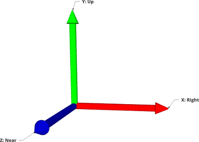

# Overall Conventions

Items here apply to all interface classes. Note that these conventions hold within the OSVR system. Game engine integrations may (and should) adapt to the engine's native conventions.

Most interfaces have a concept of "sensor" or "channel": this is a numbered data source for a particular interface class on a device name. A sensor may not be a literal sensor - it may be a feature point in the environment, a different semantic value, etc. - but it should have a persistent identity for that device and interface. There is no required correspondence between sensor numbers for different interface classes on a device: Tracker 0 may physically be associated with Button 0, 1, 2, and 3, and Analog 0 and 1. These relationships are not automatically implied, and thus are to be described in the JSON descriptor for a device.

## Units

- Distance/length: meters
- Orientation: unit (normalized) quaternions in a right-handed system
- Time (for use in derivatives): seconds, unless otherwise noted
- Linear velocity: m/s
- Linear acceleration: m/s^2
- Angular velocity: an incremental unit (normalized) quaternion and a time interval.
- Angular acceleration: an incremental unit (normalized) quaternion and a time interval.

Rotational derivatives are reported as a paired quaternion and delta time to be able to avoid limitations in the expressivity of quaternions for incremental rotations.

## Coordinate Systems
The global OSVR coordinate system is right-handed, with _x_ to the right and _y_ up. When depicted with only color as a label, axes match RGB-XYZ respectively.

