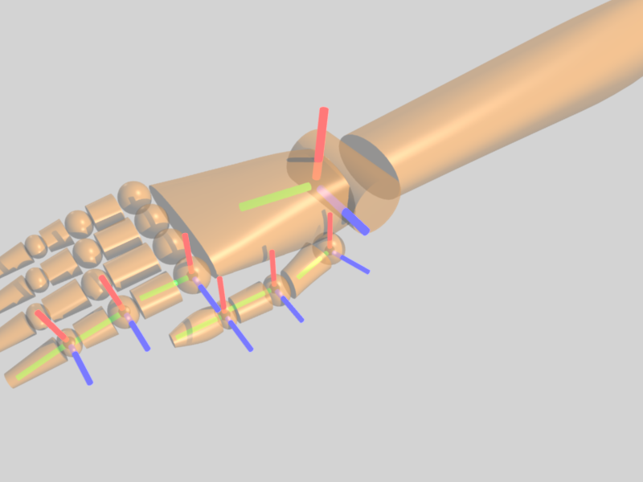

# Interface Class Specification: Skeleton Tracking

> Status: **in progress**

## Device class summary
This class of devices often provides tracking of joints, limbs, or body parts as a subset of its functionality. The underlying technology may be varied, from vision-based (Leap Motion), to depth-camera based (Kinect/PrimeSense, Kinect 2), to tracker-based (NaturalPoint OptiTrack, ART motion capture and finger tracking), even to datagloves if broadly construed. In some cases, a model is built in to the vendor software to extrapolate an articulated state from the directly-sensed data.

The primary unifying trait is that rather than providing (or only providing) rigid body tracking, they track an articulation, usually of a human user or a region thereof. On a related topic, because connectivity at a minimum and often anatomical association is reported, there is a desire for access to connectivity and exploration of available anatomically-linked reports (in a consistent state) in order to provide a virtual representation of the user in the client software.

Investigation has uncovered a number of existing vendor-specific skeleton representations, as well as several de-facto standards for inferring anatomical association from rigid-body tracker sensor number.

In a sense, the Skeleton's server interface is primarily about relatively static definitions of articulations, association of Tracker interface reports with joints in those descriptions, conventions regarding the coordinate systems involved, and indicating completion of consistent state update. The client interface additionally provides a technique for traversing and understanding tracker reports, as well as derived state inquiries (getting bone length and orientation, based on two joints or sites) that may provide a more natural interface for the developer. As such, this interface class specification varies from earlier examples by focusing more on API than protocol.

Readers are encouraged to consult the references, particularly the H-ANIM specification.

### Examples
- Hand/finger tracking
	- Leap Motion <https://www.leapmotion.com/>
	- Intel RealSense <http://www.intel.com/content/www/us/en/architecture-and-technology/realsense-overview.html> (See also Creative Sens3D <http://us.creative.com/p/web-cameras/creative-senz3d>)
	- ART Fingertracking <http://www.ar-tracking.com/products/interaction/fingertracking/>
	- More indirectly, bend sensor-based datagloves such as
		- 5DT DataGlove Ultra <http://www.5dt.com/?page_id=34>
- Whole-body Skeleton
	- PrioVR <http://priovr.com/>
	- Kinect/PrimeSense, Kinect 2 <http://www.microsoft.com/en-us/kinectforwindows/>
	- SoftKinetic: provides depth cameras and iisu body/hand tracking separately <http://www.softkinetic.com/>
	- Nod skeletal tracking http://developer.nod.com/blog/Nod-Skeletal-Tracking-Unity/
	- NaturalPoint OptiTrack <https://www.naturalpoint.com/optitrack/products/motive/body/>
	- ART Motion Capture products <http://www.ar-tracking.com/products/motion-capture/art-human/>

### Relation to other classes
**Factoring**: The Skeleton class is most closely related with tracking, but provides connectivity and anatomical association beyond just rigid body transforms.

**Skeleton from other classes**: Many body-tracking systems (particularly as one moves closer to industry) are based on tracking of markers, which may be at the joint or positioned somewhere else on the "bone". Additionally, as the PrioVR and Nod examples indicate, it is possible, with the use of a model, to infer skeleton data from less than 6DOF-tracked markers. While the transformation is not necessarily trivial or accurate, one could also interpret bend sensor glove data to infer tracker and skeleton data, which is often done implicitly by software that uses datagloves or by the vendor's SDKs. Vision-based systems demonstrate that imaging data can be turned into tracked skeletons, whether loosely coupled to hardware (like the RealSense SDK and the SoftKinetic software)  or tightly integrated (LeapMotion, some usage of Kinect).

Skeleton capabilities as described here can be added to existing skeleton-like streams (such as from FAAST) by an analysis plugin monitoring the reports and injecting a skeleton-complete message after observing a full data frame.

**Skeleton to other classes**: As the skeleton interface is essentially construed as a layer over one or more tracker devices, analysis that generates skeleton data necessarily generates tracker data. Tracker data with joints reported at specific sensor numbers to match an existing de-facto standard might also be used, for porting pre-OSVR software to work with OSVR-supported skeleton data providers. Skeleton data can be analyzed to extract "gestures," and existing SDKs often include a few built-in gestures. An important distinction for Skeleton data is that more than other interfaces, it is likely to be directly visualized as a humanoid or anatomical subset.

**Skeleton fusion and transformation**: Multiple providers of skeleton data may exist, at different levels of granularity (for instance, a Kinect and an HMD-mounted Leap Motion controller) or with different fields/points of view (multiple Kinects or Leap Motion controllers). Analysis plugins may be created to take in skeletons and merge them, providing a unified skeleton with full data and high detail (different granularity), wider range of motion (different FoV), or more accuracy (different PoV). Analysis plugins may also associate a skeleton that has left the view of a vision-based system with one that has entered, identifying them as being the "same hand", for instance. Conceivably, one could envision combining a vision-based skeleton tracker with another sensor (Nod ring, for instance) to assign persistent identities to a skeleton and associate them with a real person.

## Terminology

- *Joint* - an articulation point between two bones (as defined below). Further, a coordinate system located at such a point, at the base of a bone they are typically named after.
	- May be considered an internal (non-leaf) node in the tree corresponding to the skeleton.
	- Not necessarily correlated 1-1 with anatomical joints.
	- For example, knuckles are joints, and the spine is typically modeled with between 2 and 4 joints.
- *Site* - A coordinate system or point specified with respect to a joint, but not a parent node.
	- See H-ANIM documents for elaboration.
	- Typically used only in the context of an end site.
- *End site* - The logical equivalent of a bone with no children - a leaf node on the tree corresponding to the end of a bone.
	- For example, a fingertip is an end site. (At times, "joints" will be used generically to refer to joints and end sites: all tracked poses that define bones.)
- *Bone* - aka segment, and not necessarily correlated 1-1 with an anatomical bone. Defined by a base joint and another joint or end site.
	- Effectively the dual of joints, just as vertices and faces are dual.
	- Generally keep a constant length over time, but this constraint is not necessarily required.
	- For example, the distal joint of a finger and the corresponding fingertip (end site) define the distal bone in that finger.
- *Skeleton* - (aka Skeleton [interface] sensor) An articulation tree (of joints) reported as a single consistent frame.
	- Does not necessarily include all the joints in the basic full body skeleton articulation
		- Includes just the subtree tracked (for instance, rooted at each upper arm for a Leap Motion, thus reporting two skeletons if both hands/arms are tracked).
		- May omit joints and end sites that the particular system does not track or model (for instance, whole-body Kinect tracking may not report fingers in its skeleton).
- *Rig* - The animation (and/or physics) centric structure controlling 3D models in a client.
	- Not directly used by the OSVR core, though game engine integrations may transform data from OSVR skeletons to control arbitrary or engine-standard rigs.
- *Frame* - This refers to a a single "observation" or consistent state of a skeleton. Since skeleton data necessarily involves more than one tracked location, and those tracked locations might be simultaneously observed (or simultaneously modeled), the concept of correlating consistent state between sensors is important.
	- As an example, consider what would happen if you just treated the sensors individually, responding as each one updated in turn. You'd find that bones shrink and grow as the basic tracker interface does not provide atomic reports of more than one sensor.

## Device description and granularity - plugin side

- **Description of the articulation structure** is relatively static, and thus included in the device descriptor JSON.

Rationale: Humans do not usually gain or lose joints during safe gameplay. The ability of the JSON to be revised at runtime leaves open the possibility of some future (vision-based?) sensor inferring joints and articulations, but this is not a primary use case.

From the point of view of the device plugin,

- One Skeleton interface sensor **per tracked articulation** (body, hand, etc).

Rationale: Substitution of one skeleton for another, in multi-user tracked scenarios

- One Skeleton interface sensor refers to **sensors from one or more Tracker interfaces** ...

Rationale: Skeletons may be overlaid on existing trackers, but must refer to at least one tracker to provide the data that isn't connectivity or association.

- ... providing **room-space** ...

(Or tracker-space - some sort of "global" to be contrasted with parent-relative. )
Rationale: Usability of joint poses by tracker clients as well as skeleton clients for new devices implementing both Tracker and Skeleton at the same time.

- ... **joint** (and site) ...

Rationale: This provides commonality between skeleton technologies. If marker-based trackers wish to also expose the marker poses, they may, but they are not directly referenced by or required by the skeleton. Similarly, skeleton solutions that adjust reported tracker data to fit a model may choose to report the raw, uncorrected data as additional tracker sensors, but in that case the skeleton should be referring to the adjusted joint tracking sensors. Joints are reported, rather than bones, to enhance interoperability by applying the Tracker interface class. From a client usability standpoint, bones may be exposed by computation from the corresponding joints.

- ... **poses** (usually) ...

Rationale: Generally, full poses are desired, since humans bones are not solids of revolution. However, for certain "end sites" that are useful and available (such as fingertip), a position-only may be reported given that there is not a child joint and bone orientation can be inferred from the parent joint.

- ... with a **standardized coordinate system**.

Rationale: While no single standard coordinate system convention will fit all client applications, consistent input data makes integration easier.

- Following transmission of a skeleton's tracker poses for a single consistent data frame, a **SkeletonComplete message** should be sent for the corresponding skeleton sensor.

## Messages

### SkeletonComplete
#### Data
- Sensor (skeleton) ID

Should be sent (reliable transport) immediately following the completion of sending all the updated joint poses (again, reliable transport) in the skeleton.

#### Rationale
For consumers of skeleton data that are looking for more than a single joint pose, observing skeleton data in a consistent state (all joints updated) is important to avoid undesirable artifacts (bone stretching). This message provides a checkpoint for such a consistent state, provides the opportunity to coalesce tracking data into the derived skeleton data, and provides a "hook" that can be used to trigger user callbacks for skeleton-oriented views of data.

## Coordinate Systems
The base-relative coordinate systems for a humanoid are proposed to be the following:

- Right-handed coordinate system
- Position at the joint/base of the bone
- *y* axis along the bone, pointing in the direction of the bone
- *z* axis coming out the front of the humanoid in a "T-pose" (more technically, a T-pose but standing "en pointe" for the feet - that is, *z* coming out the top of the feet)

This overall diagram shows some sample joint coordinate systems following this convention. (As always, RGB correspond to XYZ.)

The following is a closeup of the right hand with select joints shown. (Note that following from the rules, the previous diagram shows that the left hand has the *x* axis pointing down instead of up.)

In 3D-capable browsers, you may be able to view an [interactive 3D viewer of this illustration](diagram/osvr_skeleton.html).

## Device Plugin Design
A plugin providing skeleton data shall report all of its tracker joints as described above, then issue a SkeletonComplete message for that skeleton sensor.

## Client API

There are three basic categories of clients that might be interested in skeleton data:
- Those performing analysis on the skeleton data, for merging skeletons, recognizing gestures, etc. They may want a joint interface or a bone interface, and may want to refer to joints or bones by name, but can adopt our naming convention. Connectivity/topology may be important (if just to determine what subset of joints are reporting), but traversal is likely to be one-time or not at all.
- Client applications wishing to connect skeleton data to a rig for character animation. Need mappings between names to effectively "retarget" skeleton data onto a character animation or game-engine-specific rig, though connectivity/topology may not be important on its own except to support heuristics for retargeting.
- Client applications wishing to animate a more abstract representation of the skeleton (capsules for bones, for instance). These clients primarily care about bones and may not even care about naming or connectivity/topology, though traversal is important for enumeration purposes.

- Alias in path tree to skeleton interface sensor provides entry point to reported skeleton data
	- Enumeration/traversal of tree provided for both bones and joints/sites, optionally identifying entities with the OSVR canonical names.
	- Direct access to joint/site and bones by OSVR canonical names, and possible also some built-in mappings.
	- Tracker data accessed through the skeleton is updated/emitted only on SkeletonComplete - so traversal ensures access to consistent, single-frame data.

## Open issues
- How best to handle external VRPN devices exposing skeleton-like data without the specific SkeletonComplete message (like those below)?
	- Require specification of number of sensors and emit SkeletonComplete when all sensors have reported? (Some systems might only report the joints they currently can observe)
	- Somehow effectively inject SkeletonComplete before the first tracker report with a different timestamp? (assumes all joints are reported with the same timestamp, which might not be true for all systems)
- How to allow systems like OptiTrack Motive (embedded VRPN server) to easily signal end of frame ("SkeletonComplete") without requiring re-write using OSVR? Map a button to SkeletonComplete?
- Bone (length) computation in bones with multiple children? (See Meredith et al 2001)
- Terminology/clarity: should we say "generalized joints" when we mean "joints and end sites" aka "things that can define bones"?

## Other resources
- Kinect data:
	- FAAST - closed-source VRPN server, uses either OpenNI or Kinect for Windows <http://projects.ict.usc.edu/mxr/faast/>
	- KVR - Open-source VRPN server, uses Kinect for Windows API, uses compatible "sensor" numbering to FAAST <https://github.com/vancegroup/KVR>
- David Nahon (3DS/Dassault) proposal for whole-body skeleton tracking convention: note that CC BY-SA (without clarification as to how far that extends) is claimed <http://www.slideshare.net/iVEvangelist/v6-unified-skeleton-for-real-time-mocap>
- VRPN skeleton proposal:
	- Full condensed proposal: <http://lists.unc.edu/read/messages?id=6607009>
	- Issue tracker with more elaborated description: <https://git.cs.unc.edu/redmine/vrpn/issues/71>
	- VRPN skeleton/glove discussion on mailing list <http://lists.unc.edu/read/messages?id=6597925>
- ISO standard based on Jack: <http://en.wikipedia.org/wiki/Humanoid_animation>

## References

- ISO standard H-ANIM (Humanoid Animation) - ISO/IEC 19774 Version 2.0 (published in 2005) - Implemented in X3D and other formats
	- Current working group homepage: <http://www.web3d.org/working-groups/humanoid-animation-h-anim>
	- Examples and other links: <http://www.web3d.org/x3d/content/examples/Basic/HumanoidAnimation/>
	- Magnenat-Thalmann, N., & Thalmann, D. (Eds.). (2004). H-Anim Joint and Segment Topology. In *Handbook of Virtual Humans* (pp. 393–395). <http://doi.org/10.1002/0470023198.app2>

- Meredith, M., Maddock, S., & Road, P. (2001). Motion Capture File Formats Explained. Motion Capture Stuff, 1–36. http://doi.org/10.1.1.103.2097

- Academic authors:

	- [Nadia Magnenat Thalmann](http://www.miralab.ch//index.php?option=com_content&task=view&id=102&Itemid=245) - [Google Scholar profile](https://scholar.google.com/citations?user=zSucrdMAAAAJ)